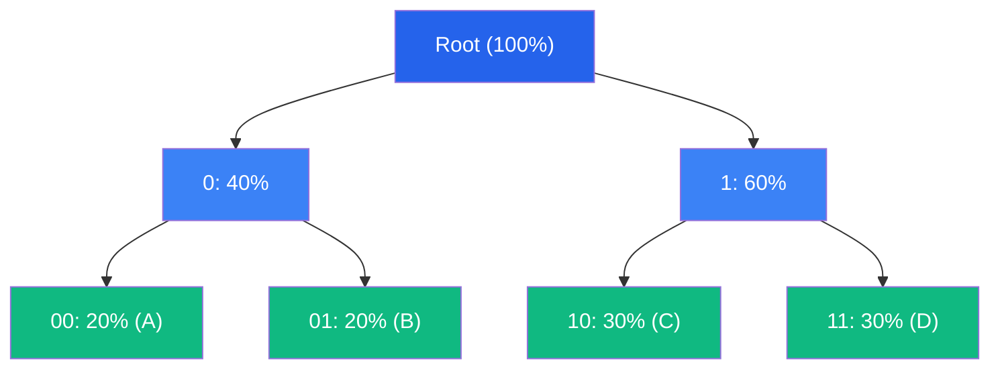

# 霍夫曼编码深度解析

霍夫曼编码是最经典的无损压缩算法之一，由 David A. Huffman 于 1952 年提出。本文将从数学原理到工程实现，全面解析这一优雅的算法。

## 历史背景

1952 年，David A. Huffman 在 MIT 攻读博士学位时，他的导师 Robert Fano 给出了一个选题：寻找最优的前缀编码方法。Huffman 放弃了当时主流的自顶向下方法，转而采用自底向上的贪心策略，最终发现了这个以他名字命名的算法。[^1]

## 数学基础

### 信息熵

设信源符号集 $S = \{s_1, s_2, ..., s_n\}$，概率分布 $P = \{p_1, p_2, ..., p_n\}$，信息熵定义为：

$$
H(P) = -\sum_{i=1}^{n} p_i \log_2 p_i
$$

**熵的含义**：表示每个符号的平均信息量，也是无损压缩的理论下限。

### 前缀码

前缀码是一种特殊编码，没有任何码字是另一个码字的前缀。这保证了编码的唯一可解码性。

**示例**：`{0, 10, 11}` 是前缀码，但 `{0, 01, 11}` 不是（`0` 是 `01` 的前缀）。

### 最优前缀码

最优前缀码使平均码长最小：

$$
L = \sum_{i=1}^{n} p_i \cdot l_i
$$

其中 $l_i$ 是符号 $s_i$ 的码长。

## 算法原理

### 核心思想

霍夫曼算法采用**贪心策略**：每次合并两个概率最小的节点，构建二叉树。

### 算法步骤

1. 为每个符号创建叶节点，权重为其概率/频率
2. 重复以下步骤直到只剩一个节点：
   - 选择两个权重最小的节点
   - 创建新节点作为它们的父节点
   - 新节点权重 = 两个子节点权重之和
3. 从根到叶的路径确定编码（左=0，右=1）

### 正确性证明

**引理**：设 $x$ 和 $y$ 是概率最小的两个符号，则存在最优前缀码使 $x$ 和 $y$ 的码长相同且仅最后一位不同。

**证明**：设 $a$ 和 $b$ 是最优码中最深的两个叶节点。若 $x$ 不是 $a$，则交换 $x$ 和 $a$ 不会增加平均码长（因为 $p_x \leq p_a$）。同理可交换 $y$ 和 $b$。∎

## 实现细节

### 树构建算法

```cpp
struct Node {
    uint8_t symbol;
    uint32_t freq;
    Node* left = nullptr;
    Node* right = nullptr;
};

struct Compare {
    bool operator()(Node* a, Node* b) {
        if (a->freq == b->freq) return a->symbol > b->symbol;
        return a->freq > b->freq;
    }
};

Node* buildHuffmanTree(const std::vector<uint32_t>& freqs) {
    // 使用最小堆（priority_queue 默认是最大堆，用 > 实现最小堆）
    std::priority_queue<Node*, std::vector<Node*>, Compare> pq;
    for (int sym = 0; sym < 256; ++sym) {
        if (freqs[sym] > 0) {
            pq.push(new Node{static_cast<uint8_t>(sym), freqs[sym]});
        }
    }

    // 合并直到只剩一个节点
    while (pq.size() > 1) {
        Node* left = pq.top(); pq.pop();
        Node* right = pq.top(); pq.pop();
        Node* parent = new Node{0, left->freq + right->freq, left, right};
        pq.push(parent);
    }

    return pq.top();
}
```

### 码表生成

```cpp
void generateCodes(Node* root, const std::string& code,
                   std::array<std::string, 256>& codes) {
    if (root == nullptr) {
        return;
    }

    if (root->left == nullptr && root->right == nullptr) {
        // 叶节点：保存编码
        codes[root->symbol] = code;
        return;
    }

    // 递归生成左右子树编码
    generateCodes(root->left, code + "0", codes);
    generateCodes(root->right, code + "1", codes);
}
```

### 边界情况处理

| 情况 | 处理方法 |
|------|----------|
| 空输入 | 返回预定义错误码 |
| 单符号 | 特殊处理：码长为 1，编码为 `0` |
| 等概率 | 退化为固定长度编码 |
| 频率为 0 | 跳过该符号，不参与编码 |

### 确定性保证

为确保确定性二进制输出，频率相同时按符号值排序：

```cpp
// 比较函数：频率相同时按符号值排序，保证确定性输出
struct Compare {
    bool operator()(Node* a, Node* b) {
        if (a->freq == b->freq) return a->symbol > b->symbol;
        return a->freq > b->freq;
    }
};
```

## 二进制格式

CompressKit 的 Huffman 编码输出格式：

```
| Magic (4 bytes) | Freq Count (4 bytes LE) | Frequencies (N × 4 bytes LE) | Bitstream | CRC-32 (4 bytes LE) |
```

- **Magic**: `HFM2` (0x48 0x46 0x4D 0x32)
- **Freq Count**: 符号数量（N）
- **Frequencies**: 每个符号的频率（小端序）
- **Bitstream**: 编码后的位流
- **CRC-32**: 小端 4 字节，覆盖此前全部字节；解码前强制校验

## 性能分析

### 时间复杂度

| 操作 | 复杂度 | 说明 |
|------|--------|------|
| 树构建 | O(σ log σ) | σ = 字母表大小（256） |
| 码表生成 | O(σ) | 遍历所有叶节点 |
| 编码 | O(n) | n = 输入长度 |
| 解码 | O(n) | 每个符号常数时间 |

### 空间复杂度

- **编码器**: O(σ) 存储码表
- **解码器**: O(σ) 存储解码树

### 实测性能

详见 [基准测试结果](/benchmarks/results)（交互式图表）。

## 与其他算法对比

### 优势

- ✅ 编解码速度快
- ✅ 实现简单
- ✅ 理论保证：最优前缀码

### 劣势

- ❌ 码长必须为整数（不如算术编码逼近熵）
- ❌ 需要存储频率表（对小文件开销大）

### 适用场景

- 速度优先的场景
- 实时压缩/解压
- 嵌入式设备

## 可视化示例



编码结果：A=00, B=01, C=10, D=11

## 扩展阅读

- [算术编码](/algorithms/arithmetic) - 逼近熵极限的方法
- [区间编码](/algorithms/range) - 整数实现的算术编码
- [架构设计](/guide/architecture) - 算法如何接入 buffer 层

## 参考文献

[^1]: Huffman, D. A. (1952). "A Method for the Construction of Minimum-Redundancy Codes". *Proceedings of the IRE*. 40 (9): 1098–1101. [DOI:10.1109/JRPROC.1952.273898](https://doi.org/10.1109/JRPROC.1952.273898)

[^2]: Sayood, K. (2017). *Introduction to Data Compression*. Morgan Kaufmann. ISBN 978-0-12-809474-7.
