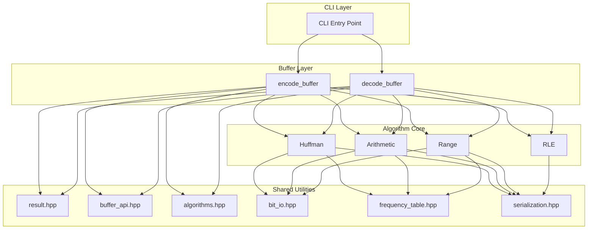

# 系统架构设计

CompressKit 采用清晰的分层架构，确保代码的可维护性、可测试性和一致的内存契约。

## 架构总览



## 分层说明

### 1. CLI Layer（命令行接口）

统一的命令行入口，支持所有算法：

```bash
./build/huffman_cpp encode input.bin output.bin
./build/huffman_cpp decode output.bin decoded.bin
```

**设计亮点**：共享 launcher 消除各算法的 CLI 样板代码。

### 2. Buffer Layer（便捷 API）

围绕 `BufferTransform` 函数指针的无状态封装：

```cpp
#include "compresskit/algorithms.hpp"
#include "compresskit/buffer_api.hpp"

auto result = compresskit::encode_buffer(huffman_encode_buffer, input);
if (result.ok()) { use(result.value); }
```

**特点**：
- 每次调用独立
- 自动体积上限检查（输入严格小于 4 GiB，解码输出至多 1 GiB）
- 统一 `Result<T>`，三种状态码

### 3. Algorithm Core（算法核心）

四种压缩算法的实现：

| 算法 | 文件 | 核心函数 |
|------|------|----------|
| Huffman | `huffman/main.cpp` | `huffman_encode_buffer()`, `huffman_decode_buffer()` |
| Arithmetic | `arithmetic/main.cpp` | `ArithmeticEncoder`, `ArithmeticDecoder` |
| Range | `range/main.cpp` | `RangeEncoder`, `RangeDecoder` |
| RLE | `rle/main.cpp` | `rle_encode_buffer()`, `rle_decode_buffer()` |

### 4. Shared Utilities（共享工具）

位于 `algorithms/shared/cpp/include/compresskit/` 的跨算法基础设施：

| 头文件 | 功能 |
|--------|----------|
| `result.hpp` | `StatusCode` 枚举与 `Result<T>` 模板 |
| `buffer_api.hpp` | `BufferTransform`、`encode_buffer`、`decode_buffer`、文件辅助 |
| `algorithms.hpp` | 各算法 `*_encode_buffer` / `*_decode_buffer` 入口 |
| `bit_io.hpp` | `BitWriter` / `BitReader` |
| `frequency_table.hpp` | 频率表读写 |
| `serialization.hpp` | 共享魔数/头序列化 |
| `cli_launcher.hpp` | 统一 CLI 分发 |
| `constants.hpp` | 共享命名常量 |

## 二进制格式规范

### 通用结构

```
| Magic (4 bytes) | Header | Payload |
```

### 各算法格式

所有格式都以 **CRC-32 尾部校验**（4 字节小端，覆盖校验和之前的全部字节）结尾，
任何比特损坏都会在解码前被检出并拒绝。

#### Huffman

```
| HFM2 | FreqCount (4B LE) | Frequencies (N×4B LE) | Bitstream | CRC-32 (4B LE) |
```

#### Arithmetic

```
| AEN2 | FreqCount (4B LE) | Frequencies (N×4B LE) | Bitstream | CRC-32 (4B LE) |
```

#### Range Coder

```
| RCN2 | FreqCount (4B LE) | Frequencies (N×4B LE) | Bytestream | CRC-32 (4B LE) |
```

#### RLE

```
| RLE2 | Runs (Count × (4B LE + 1B)) | CRC-32 (4B LE) |
```

### 频率表格式

- 顺序：符号 0-255（字节值），符号 256（EOF）
- 字节序：小端序（Little-Endian）
- 总大小：4 字节（符号计数）+ 257 × 4 字节 = 1032 字节

## 安全边界

| 限制 | 值 | 目的 |
|------|-----|------|
| 原始数据上限（编码输入 / 解码输出） | 严格小于 1 GiB | 编码输入可完整 round-trip；`uint32_t` 频率计数永不回绕；解码侧防止解压缩炸弹 |
| 压缩输入上限（仅解码） | 严格小于 8 GiB | 压缩流可大于原始数据（RLE 对不可压缩输入最坏膨胀约 5×），为 round-trip 留出空间，同时约束读入内存的体积 |
| 频率表总和上限（解码校验） | ≤ 2²⁴ | 熵编码解码器的除法不变量要求；超限或无 EOF 符号的表一律拒绝 |

## Deep Module 设计

CompressKit 遵循 Deep Module 原则：

```
Deep Module = 简单接口 + 复杂实现

encode_buffer(transform, input) -> Result<bytes>
    ↓
隐藏的复杂性：
- 体积上限强制
- 错误传播
- 位对齐
- 频率表序列化
```

**好处**：
- 用户只需理解简单接口
- 内部复杂性不影响用户代码
- 易于测试和维护
